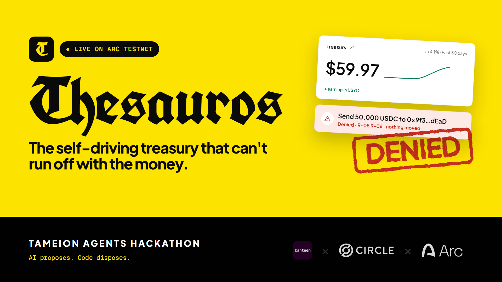
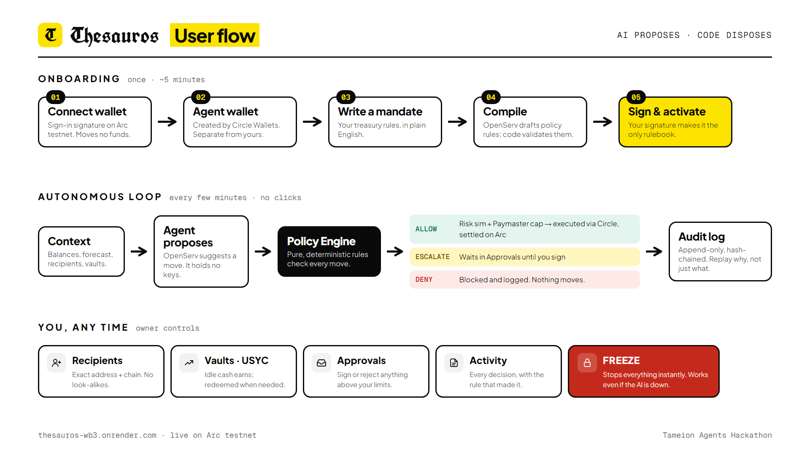
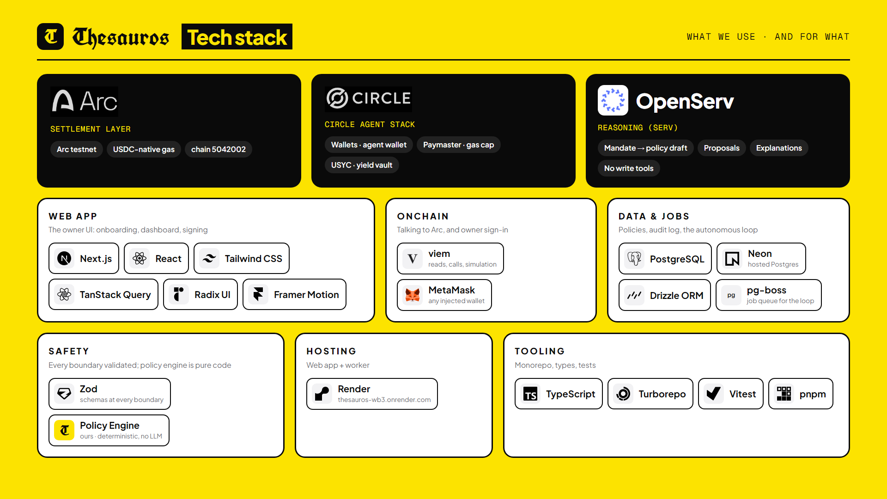

<div align="center">



# Thesauros

**The treasury that reconciles itself before it pays.**

An AI-operated business treasury on Arc. The AI proposes. Code disposes.

[**Live app**](https://thesauros-wb3.onrender.com) · [Demo video](#demo) · [How it works](#how-it-works) · [Run it locally](#run-it-locally) · [Docs](#documentation)


</div>

---

## What it is

**Thesauros** (θησαυρός, Greek for "treasury" — the storeroom money was kept in) lets a business owner
write a plain-English **mandate** and hand the day-to-day running of the treasury to an autonomous agent
that cannot move money outside it.

1. You write a mandate in plain English.
2. Thesauros compiles it into an explicit, numeric **policy** that you read and sign.
3. An autonomous loop keeps idle USDC working in **USYC**, pays allowlisted recipients, and re-screens
   counterparties on a schedule.
4. Every proposal passes a **deterministic Policy Engine** and a **simulation gate** before anything is
   sent. A model output can never move funds by itself.
5. You can **freeze** or **sweep home** at any time, even if the AI, the worker or the reasoning API is down.

Built for the **Tameion Agents Hackathon** (Canteen × Circle), **RFB 1 — Intelligent Business Treasury**,
with **RFB 5 — Compliance Intelligence** as a secondary surface. Settled on **Arc testnet** in USDC.

> A ledger checks that debits equal credits. It does not check that the agent's reasoning was sound.
> Thesauros keeps an append-only, hash-chained audit log so a reviewer can replay _why_, not just _what_.

## Demo

- **Live app:** https://thesauros-wb3.onrender.com (Arc testnet — connect any injected wallet such as MetaMask)
- **Demo video (under 3 minutes):** linked in the hackathon submission form
- **Walkthrough script:** [`docs/DEMO.md`](docs/DEMO.md)
- **Tester guide and sample mandates:** write a mandate such as _"Keep $200 liquid, put the rest in USYC,
  pay Acme up to $50 a month"_ during onboarding and watch it compile.

## How it works



| Stage                                   | What happens                                                                                                                                                                                                                                                      |
| --------------------------------------- | ----------------------------------------------------------------------------------------------------------------------------------------------------------------------------------------------------------------------------------------------------------------- |
| **Onboarding** (once, about 5 minutes)  | Connect a wallet (sign-in only, moves no funds) → a separate Circle agent wallet is created → write a mandate → OpenServ drafts policy rules and code validates them → your signature makes the policy the only rulebook.                                         |
| **Autonomous loop** (every few minutes) | Gather deterministic context (balances, forecast, recipients, vaults) → the agent proposes a move → the Policy Engine returns `ALLOW`, `ESCALATE` or `DENY` → allowed moves are simulated, then executed through Circle → everything is written to the audit log. |
| **Owner controls** (any time)           | Recipients (exact address + chain, no look-alikes), Vaults (idle cash earns, redeemed when needed), Approvals (sign or reject anything above your limits), Activity (every decision and the rule behind it), and **Freeze**.                                      |

### Safety model

Verdict precedence is always **`DENY` > `ESCALATE` > `ALLOW`**, and anything unknown fails closed.

- **Reasoning never touches funds.** Only one module may call a Circle write action, and only with a valid,
  unexpired, single-use allow-receipt from the Policy Engine. The model is never given a write tool.
- **The Policy Engine is pure code.** No network, no model, no clock, no randomness. It has a rule
  catalogue (for example R05 non-allowlisted destination, R06 per-transaction cap) and every denial names
  the rule that caught it.
- **Exact-match destinations.** Recipients and contracts match by checksummed address and chain id.
- **Simulate before sending.** Each action is dry-run against real chain state through Arc's
  `Multicall3From` contract, and the measured balance deltas must match the proposal.
- **Owner always wins.** Freeze, revoke and sweep-home never call the reasoning layer.
- **Append-only audit.** Every snapshot, proposal, verdict, execution, approval and freeze writes a row; a
  database trigger blocks updates and deletes, and the chain can be verified from Settings.
- **Money is `bigint`.** Token amounts are base units, USD values are integer micro-USD. No floating point.

The full invariant list lives in [`CLAUDE.md`](CLAUDE.md) and [`docs/SECURITY.md`](docs/SECURITY.md).

## Tech stack



| Layer              | Technology                                                                                                                                 |
| ------------------ | ------------------------------------------------------------------------------------------------------------------------------------------ |
| Settlement         | **Arc testnet** (chain id 5042002), USDC-native gas                                                                                        |
| Circle Agent Stack | **Wallets** (developer-controlled agent wallet), **USYC** (yield vault through the Teller), sponsored gas through Circle's gas sponsorship |
| Reasoning          | OpenServ (SERV) for mandate-to-policy drafting, proposals and explanations, with no write tools                                            |
| Web app            | Next.js, React, Tailwind CSS, TanStack Query, Radix UI, Framer Motion                                                                      |
| Onchain            | viem for reads, calls and simulation; MetaMask or any injected wallet for owner sign-in and signatures                                     |
| Data and jobs      | PostgreSQL (Neon), Drizzle ORM, pg-boss job queue                                                                                          |
| Safety             | Zod schemas at every boundary; the pure Policy Engine package                                                                              |
| Tooling            | TypeScript (strict), pnpm, Turborepo, Vitest, dependency-cruiser                                                                           |
| Hosting            | Render (web and worker)                                                                                                                    |

## Circle tool usage

| Tool                | How Thesauros uses it                                                                                                                                                                                 |
| ------------------- | ----------------------------------------------------------------------------------------------------------------------------------------------------------------------------------------------------- |
| **Arc**             | Settlement layer. USDC is the gas token, so each action costs about a cent.                                                                                                                           |
| **Wallets**         | Each treasury gets its own developer-controlled agent wallet, separate from the owner's wallet. All sends go through the Circle-backed executor.                                                      |
| **USYC**            | Idle USDC is deposited into the USYC Teller and redeemed when the forecast needs cash. Share price is read live from the USYC price API. Access needs a Circle allowlist, which our agent wallet has. |
| **Gas sponsorship** | Gas is sponsored account-wide in the Circle console, which backs the Policy Engine's own per-action caps.                                                                                             |
| **USDC**            | The unit of account for balances, recipients, caps and payments.                                                                                                                                      |

Not built yet: CCTP cross-chain payments, Gateway and EURC. They are planned, not claimed.

## Judging criteria

| Criterion                        | Where to look                                                                                                                                                                                                                 |
| -------------------------------- | ----------------------------------------------------------------------------------------------------------------------------------------------------------------------------------------------------------------------------- |
| **Agentic sophistication (30%)** | The agent decides _what_ to do (deposit, redeem, pay, hold) and _why_; a deterministic engine verifies it. Mandate compilation, proposals with explanations, an anti-repeat guard, and a reviewable decision log in Activity. |
| **Traction (30%)**               | Live on Arc testnet with real testnet USDC moving through USYC and recipient payments. Figures are reported in the submission form.                                                                                           |
| **Circle tool usage (20%)**      | Arc, Wallets, USYC and gas sponsorship, as listed above.                                                                                                                                                                      |
| **Innovation (20%)**             | "AI proposes, code disposes": a pure policy engine, receipt-gated execution, simulation through `Multicall3From`, and a hash-chained audit trail.                                                                             |

## Run it locally

Requires Node 22+, pnpm and Docker.

```bash
pnpm install
cp .env.example .env.local   # fill in CIRCLE_API_KEY, CIRCLE_ENTITY_SECRET, SERV_API_KEY,
                             # SESSION_SECRET and RECEIPT_HMAC_SECRET (see .env.example)
docker compose up -d
pnpm db:migrate
pnpm dev                     # web on :3000, worker in the background
```

Circle credentials come from the [Circle Developer Console](https://console.circle.com) (a developer-controlled
wallets API key plus a registered Entity Secret). OpenServ credentials come from [openserv.ai](https://openserv.ai).
Secrets live only in `.env.local`, which is git-ignored.

### Try it without connecting your own wallet

```bash
pnpm db:seed:demo   # provisions a real Circle testnet treasury, a policy and recipients
pnpm demo:attack <walletId> <recipientId>
```

`demo:attack` fires an over-cap payment and a payment to a non-allowlisted address through the real
Policy Engine and prints the `DENY` verdict with the rule that caught each one.

### Checks

```bash
pnpm typecheck && pnpm lint && pnpm test && pnpm check:arch && pnpm build
```

`pnpm check:arch` enforces the import boundaries behind the safety model (no Circle write calls outside the
executor, no network or model imports inside the Policy Engine).

## Repository layout

```
apps/
  web/        Next.js owner UI and API routes
  worker/     autonomous decision loop and job handlers
packages/
  policy/     pure Policy Engine (rules, verdicts, allow-receipts)
  reasoning/  OpenServ client, mandate compiler, prompt-injection defences
  wallet/     Circle executor, USYC reads, action registry
  risk/       simulation and risk gate
  context/    deterministic context gathering
  db/         Drizzle schema, migrations, append-only audit log
  shared/     schemas, env, money math, signing messages
contracts/    Solidity test contracts
scripts/      demo seed, attack script, live end-to-end checks
docs/         specs, decisions and verification log
```

## Documentation

| Doc                                                        | Purpose                                             |
| ---------------------------------------------------------- | --------------------------------------------------- |
| [`CLAUDE.md`](CLAUDE.md)                                   | Invariants and build workflow                       |
| [`docs/PRD.md`](docs/PRD.md)                               | Product requirements                                |
| [`docs/ARCHITECTURE.md`](docs/ARCHITECTURE.md)             | System design and runtime flows                     |
| [`docs/SECURITY.md`](docs/SECURITY.md)                     | Threat model and failure matrix                     |
| [`docs/POLICY_ENGINE.md`](docs/POLICY_ENGINE.md)           | Policy schema and rule catalogue                    |
| [`docs/CIRCLE_INTEGRATION.md`](docs/CIRCLE_INTEGRATION.md) | Circle Agent Stack setup                            |
| [`docs/VERIFY.md`](docs/VERIFY.md)                         | External facts verified against live Arc and Circle |
| [`docs/PROGRESS.md`](docs/PROGRESS.md)                     | Status log and decision record                      |
| [`docs/DEMO.md`](docs/DEMO.md)                             | Three-minute demo script                            |

## Status and limits

Thesauros runs on **Arc testnet only**. Mainnet is refused by the code unless explicitly enabled after a
sign-off gate. The `DEMO DATA` banner appears whenever demo price overrides are active. Partial vault
withdrawals are not available for the USYC Teller (full exit only), and USYC access requires a Circle
allowlist.

## Credits

Hosted by [Canteen](https://thecanteenapp.com), with [Circle](https://www.circle.com) as platform partner
and [Arc](https://docs.arc.network) as the settlement chain. Reasoning is provided by
[OpenServ](https://openserv.ai).

Built by Shane Joans V.
